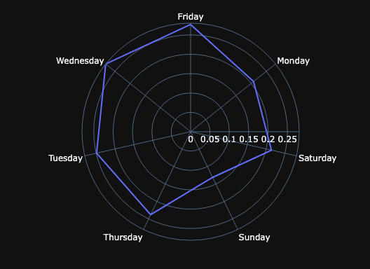
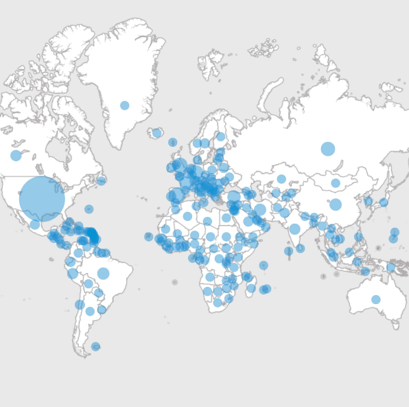
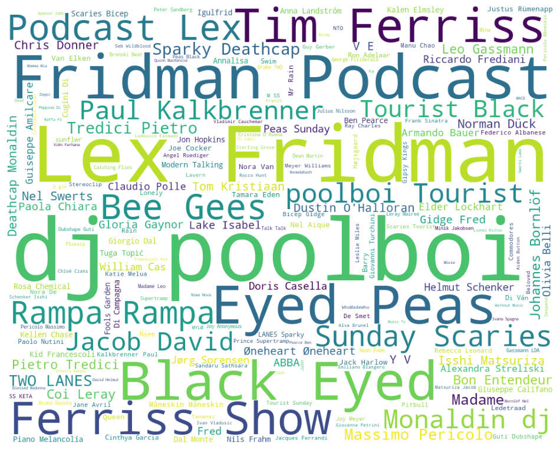
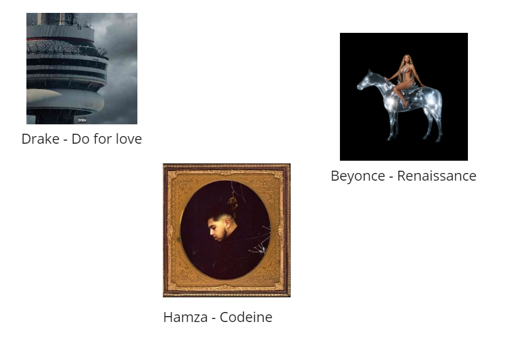
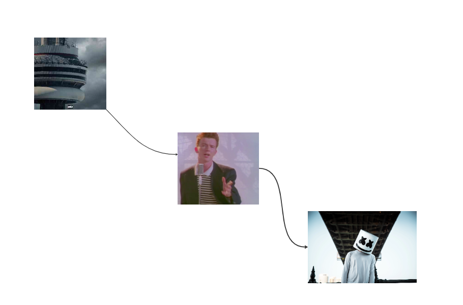
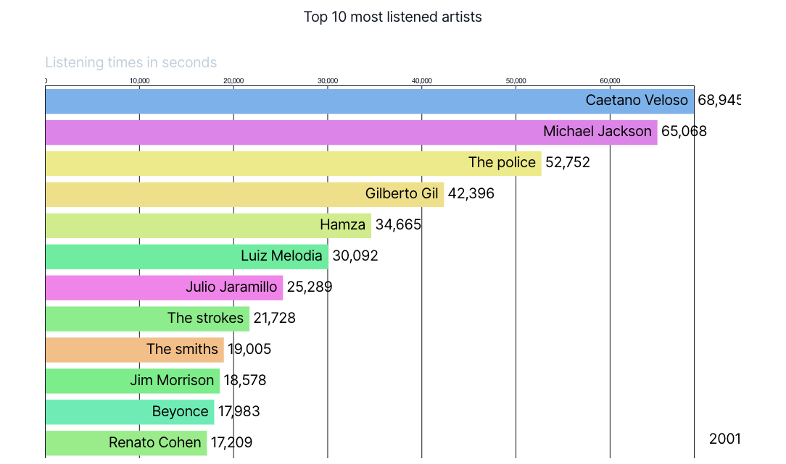
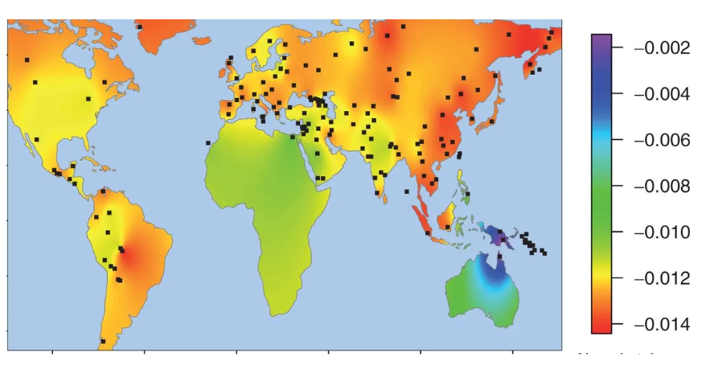
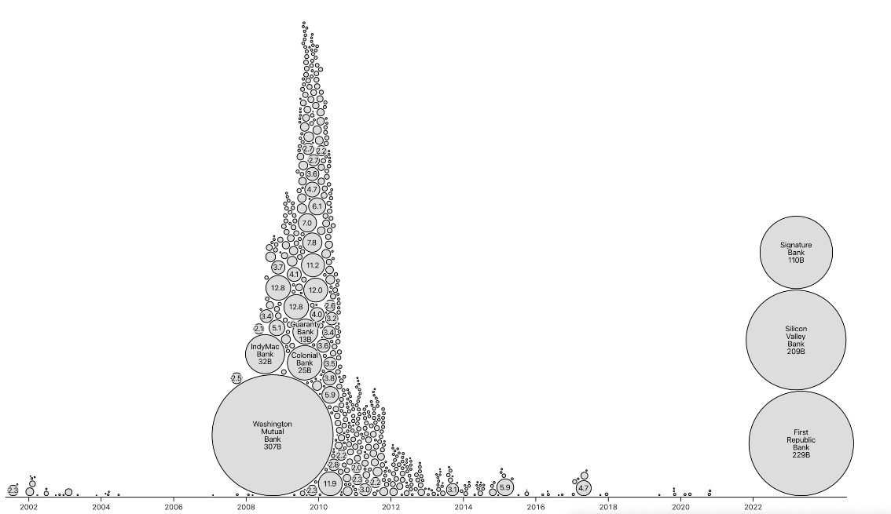

# Project of Data Visualization (COM-480)

## Milestone 2 (5th of May, 5pm)
**10% of the final grade**

Two A4 pages describing the project goal: [here](Plottwistters.pdf)

Website code located under webserver in webserver branch of this repo: [here](https://github.com/com-480-data-visualization/project-2023-plottwisters/tree/webserver/webserver)

Functional project prototype review: [here](https://64548019311497495ec4537c--remarkable-lollipop-a7497e.netlify.app/)

The goal of our website is to develop visualizations that can provide insights to the users. Therefore, our visualization will be generated at run time by the user uploading Spotify data, augmented through APIs to obtain audio features as discussed in milestone#1. Inside the website, we will be providing the following visualizations. 

## 1 Spider visualization of audio features

**Description:** Visualization of danceability, energy and other factors through each day, month, and year of the songs that the user has played.

**MVP:** One metric per plot as was done in milestone 1.

**Full version:** Multiple metrics in the plot and a selector that allows the user to choose between: days of the week, months, and years.

**How to achieve:** We can use Plotly and then add the other sizes. We can add a picker with the following options "days, months, years".

**Lecture references:** N/A

## 2 Map frequency of played tracks

**Description:** Show listening times on a world map displaying frequency in bubbles.

**MVP:** It will use a fixed window of time.

**Full version:** It will use a time bar, making the map interactive.

**How to achieve:** We will use D3, Leaflet, or other higher-level tools to achieve a map visualization and the time bar. With the help of Spotify data and the use of IP embedded in the data, we could point out a precise location, therefore we will be able to point cities, and not just countries.

**Lecture references:** Maps from lecture 8 and how to design one with practical lab maps.

## 3 Wordcloud artists/tracks

**Description:** Wordcloud of most listened tracks and artists.

**MVP:** It will use a fixed window of time.

**Full version:** It will use a time bar to see more fine-grained results.

**How to achieve:** Word cloud library in Python for prototyping. Then we will use D3 to create our custom word cloud visualization.

**Lecture references:** Tag cloud from Lecture 9.

## 4 Most played tracks/artists 

**MVP:** It will use a fixed window of time.

**Description:** Visualization will have floating most listened tracks/albums/artists and filters, such as country.

**Full version:** It will use a time bar to see more fine-grained results.

**How to achieve:** JS dictionary that contains per entry frequency and country, then use filtering based on the user selection for country.

**Lecture references:** Lecture 9.

## 5 Graph tracks relations

**Description:** Explore the most frequent user's selection of music after listening to certain music. For instance: The user listens to Do for love -> Never gonna give you up-> Alone.

**MVP:** Node graph where each node is a song listened to, where we only consider the most frequent relations and relations of up to nodes.

**Full version:** We want to ideally add interactivity and expand the relations between songs.

**How to achieve:** We have the idea of calculating an adjacent matrix between songs and adding a frequency metric, then we would like to explore the usage of d3-graphviz to create the most popular relations.

**Lectures references:** Node link diagram Lecture 10.

## 6 Horizontal bar chart animated with time

**Description:** Show time spent on the most listened tracks and animate its sizes and positions in the rank as time goes by. For instance: https://observablehq.com/@mbostock/most-popular-programming-languages-2004-2021.

**MVP:** It will use a fixed window of time and no animations or time bar.

**Full version:** Add interactive and a time bar for browsing through time.

**How to achieve:** We will use D3 or other higher-level tools to develop a horizontal bar chart that animates the time played through time.

**Lectures references:** Stacked bar charts from Lecture 11.

## 7 State of mind

**Description:** Plot your emotional/mind state (sad, party, focus, introspective, etc.) on a map, where each color represents a mental state.

**MVP:** Add marker points with the name of the most likely state of mind that you have in the location.

**Full version:** Create a heatmap map to show the scores of the audio features in each location that you have visited.

**How to achieve:** With the help of leafmap we can add a map to our website for MVP. Once this is done, we will try to find examples using a heatmap, otherwise, we will look into a practical lab of maps to implement one.

**Lecture references:** Maps from lecture 8 and how to design one with practical lab maps.

## 8 Genres played through time

**Description:** This visualization will be similar to a bubble chart with only an X-axis indicating the time (months). Each bubble represents a genre listened to, and its radius is determined by the time played in milliseconds.

**MVP:** A bubble chart rendering without interactivity or time, only using a fixed time window.

**Full version:** Add a time bar for browsing through time.

**How to achieve:** Aggregate the information of genre-based of Spotify data along with time_ms, and plot these results with the help of d3js.

**Lectures:** N/A.
